<picture>
  <source media="(prefers-color-scheme: dark)" srcset="assets/banner-dark.svg">
  <source media="(prefers-color-scheme: light)" srcset="assets/banner-light.svg">
  
</picture>

  
  

## 👋 Hi, I'm Michael

I help teams design secure cloud platforms, modernize applications, and build grounded AI solutions. My background spans **16+ years** across financial services, healthcare, energy, media, and the public sector.

## 🔭 What I'm Building Now

### 🤖 Foundry Agent Lab

**One foundation. Repeatable agent releases.** A private Microsoft Foundry lab where hosted agents work as a team to review real-world paperwork. Every finding quotes its source, and people make the call.

| Agent | What it does |
| --- | --- |
| **🧭&nbsp;Application&nbsp;&&nbsp;case&nbsp;helper** | Coordinates the team: reads the request and hands it to the right specialist. |
| **📋&nbsp;Application&nbsp;checker** | Checks an application against explicit criteria and flags missing budgets, owners, and conflicting schedules. |
| **🗂️&nbsp;Case&nbsp;notes&nbsp;summarizer** | Turns scattered case notes into a cited brief, calling out conflicting dates and missing evidence. |

Plus a **Create agent** flow that publishes new agents from reviewed templates, like a supplier invoice reviewer that catches billing that doesn't match the purchase order.

**Under the hood:** private networking end to end · managed identities, no API keys · Terraform with Azure Verified Modules · versioned releases with rollback · evaluations and tracing

**The plan**

- ✅ **Shipped:** Private, keyless platform in Terraform · coordinator and specialist review agents · create-agent flow, evaluations, and tracing.
- 🔜 **Up next:** More specialist agents for public-sector and healthcare workflows, released on the same foundation.

### 🛠️ Also in the Works

- 🧩 **Copilot agent workflows** — Extensible agents and portable workflows for day-to-day admin, reporting, and oversight.
- 🚀 **Copilot Studio automation** — Beginner-friendly tooling to deploy configuration, infrastructure, and agents.

## 🎯 What I Focus On

- 🧠 **Enterprise AI** — RAG, grounded assistants, and agentic workflows on Microsoft Foundry and Azure OpenAI.
- ☸️ **Application Modernization** — Cloud-native architecture, AKS, containers, and GitOps.
- 🏗️ **Platform Engineering** — Terraform and Bicep, CI/CD with GitHub Actions, and developer enablement.
- 🛡️ **Cloud Architecture** — Landing zones, hybrid cloud, security, private networking, and resilience.

## 🧰 Tech Stack

<picture>
  <source media="(prefers-color-scheme: dark)" srcset="https://skillicons.dev/icons?i=azure%2Caws%2Ckubernetes%2Cdocker%2Cterraform%2Cgithubactions%2Cpython%2Cpowershell%2Ccs%2Cbash%2Cgit%2Cvscode&theme=dark">
  
</picture>

**AI & agents**

**Cloud-native**

## 📜 Certifications

## 🎓 Education

B.S. in Information Systems, *cum laude*, Ramapo College of New Jersey

---

Opinions are my own.

